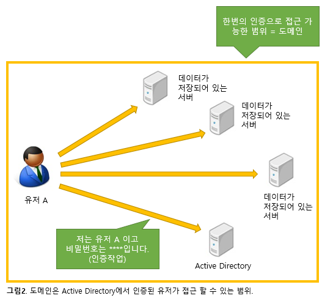

# Active Directory의 필요성

## Active Directory를 사용하는 이유

2000년에 출시 된 Windows 2000 Server의 핵심기능으로 등장한 ==Active Directory==는 현재까지 많은 기업에서 도입하고 있다.

IT교육 연수 현장에 있는 필자 입장에서 보면 10년전과 지금은 기술자가 배우는 분야/항목은 현격히 늘었고 Active Directory의 학습에 예전만큼 시간을 내기 어렵다는 것을 안다.

그래서 이 글에서 10년전에 설계/구축/운용했던 사람으로부터 바통을 넘겨받은 IT운용관리자에게 Active Directory에 대해 묻고 답하는 형식으로 학습에 도움이 되는 정보를 전하고 싶다.

첫번째 장에서는 "Active Directory는 왜 필요한 걸까?"라는 기본적인 질문에 답을 해보자.

##### "당신은 누구입니까?" 를 확인하는 구조로

일반적인 기업의 사내시스템은 회사의 직원이라면 아무나 접근 가능한 데이터도 있고 일부 사람만 접근할 수 있는 데이터도 있다. 이 일부 사람밖에 접근할 수 없는 데이터에 아무나 접근하면 곤란하다.

그래서 접근 가능한 사람을 판단하기 위해 "당신은 누구입니까?"라고 확인하는 구조가 필요하다. 이 "당신은 누구입니까?"를 확인하는 구조를 ==**인증**==이라고 부르고 Windows Server기반의 시스템에 인증 기능을 제공하는 것이 Active Directory이다. Active Directory는 기본적으로 사용자이름과 비밀번호로 확인한다.  

당신의 주의에는 혼자 여러 개의 유저명을 쓰거나 1개의 유저명을 여러 사람이 공유해 쓰고 있지않는가? 유저명이 누굴까를 확인하는 구조임을 감안하면 이러한 사용법은 이상한 일인 것을 알 수 있을 것이다.

##### 유저명/비밀번호를 여러번 입력하지 않기 위해서

유저명과 비밀번호에 의한 Active Directory의 인증은 "당신은 누구입니까?"를 확인하기 위한 구조이다. 인증에 의해 "당신은 A씨군요."라는 것을 확인한 경우 "A씨이다"라는 이해 하에 접근할 수 있는 범위를 Active Directory에서 도메인이라고 부른다. 즉, 도메인은 "한번의 로그인으로 접근 가능한 범위"이다.

예를 들면 회사에서 도메인을 작성한 경우는 유저명과 비밀번호를 입력해 인증을 끝내면 사내의 여러 데이터에 접근 할 수 있다.  그리고 Active Directory에서 한번 인증받으면 그 도메인에 참가하고 있는 서버 상의 데이터에 접근할 때는 하나하나 유저명과 비밀번호를 입력할 필요가 없다. 

인증의 세계에서는 유저명과 비밀번호를 한번 입력하는 것만으로 어느 서버에 접근할 수 있는 구조를 Single Sign-On 이라고 한다.

여기까지의 말을 종합하면 「Active Directory를 사용해 Single Sign-On할 수 있는 범위가 도메인이다」 라고 할 수 있다.

그러나 최근에는 기업의 합병도 늘어 합병하는 회사가 각각의 Active Directory도메인을 이미 운용하고 있는 경우도 많다. 이런 경우 회사는 합병 되었어도 Active Directory 도메인은 합병하지않고 따로 운용하는 경우도 있다. 그래서 Active Directory에는 「신뢰관계」라는 기능으로, 2개의 Active Directory 도메인을 연결해 양쪽의 도메인에 통합 인증할 수 있는 방법이 있다.

또, 최근에는 사내 시스템 (온프레미스)뿐만 아니라 클라우드 서비스도 조합한 이른바 하이브리드 클라우드를 이용하려고 하는 기운이 높아지고 있다. 이러한 시대의 흐름을 타 사내의 Active Directory를 이용해 한번의 로그인작업으로 접근할 수 있는 범위를 클라우드까지 넓히려면 어떻게 해야 좋을까?  이러한 경우에는 Active Directory의 부속 기능인   「Active Directory 페더레이션 서비스」 (ADFS)을 이용하는 방법이있다. 

신뢰관계나 ADFS를  조합하고 활용함으로써 Active Directory에 의한 SSO의 범위가 넓어지고,  유저명과 비밀번호를 여러 번 입력하는 수고를 덜게 된다. (신뢰관계나 ADFS의 자세한 설명은 이후의 장에서 설명할 예정이다) 특히 최근에는 클라우드서비스의 종류나 이용도 늘어 유저명과 비밀번호를 입력할 일도 많아졌기 때문에 Active Directory와 클라우드서비스를 연계할 수 있는 것은 필자로서도 기쁜일이다.

##### 유저명/비밀번호를 사용하지 않고 인증하기

Active Directory는 기본적으로 유저명과 비밀번호를 사용해  「당신은 누구?」를 확인한다. 이것은 즉, 유저명과 비밀번호를 안다면 누구든지 「다른사람」이 될 수 있다는 것이다. 이러한 일이 요즘 자주 발생되고 있고 비밀번호를 훔쳐 다른 사람으로 로그인하는 일이 문제가 되고있다.  Active Directory에서는 이러한 문제를 해결하기 위해 유저명과 비밀번호 이외의 방법도 사용하고있다. 

예를 들면 별도의 하드웨어가 필요하지만 지문을 사용해 인증하거나 「스마트카드」 라고 불리는 칩이 내장된 카드를 사용해 인증하거나 하는 것도 가능하다.  이러한 인증은 모든 유저명과 연관 지어 두는 것으로 실현가능하다. 유저명과 패스워드에 의존하지않는 인증을 실현 가능한 것도 Active Directory가 도입된 이유 중 하나이다.

##### 인사시스템으로서

거의 모든 회사에서는 인사정보를 등록한 시스템이 있을 것 이다. 인사시스템에 등록된 정보는 회사에 따라 다르지만 이름, 전화번호, 부서명 정도 간단한 정보를 등록한다면 Active Directory를 활용할 수 있다.

Active Directory가 등장한 직후에는 입력한 정보를 활용할 수 있는 기능이 없었기 때문에 굳이 입력할 필요가 없었다. 그러나 요즘은 Active Directory에 인사정보를 등록해 보다 세세한 접근을 제어 할 수 있다. 

예를 들면, 특정 데이터에 접근권한을 설정할 때, Windows에서는 「접근허가」 라는 구조로 유저명을 바탕으로 접근 가능한 유저를 결정한다. 그러나 회사에서는 특정 데이터에 접근할 수 있는 사람은 부서명이나 직책으로 결정되는 경우가 많다. 그래서 유저명이 아니라 Active Directory에 등록된 직책이나 부서명을 바탕으로 접근권한을 설정한다. 

여기까지, Active Directory를 사용하는 이유에 대해 알아보았다. 다음 장에서는 구체적으로 Active Directory의 설정방법 등에 대해 설명해 나갈 예정이다. 

출처: <http://www.atmarkit.co.jp/ait/articles/1404/11/news028.html> 