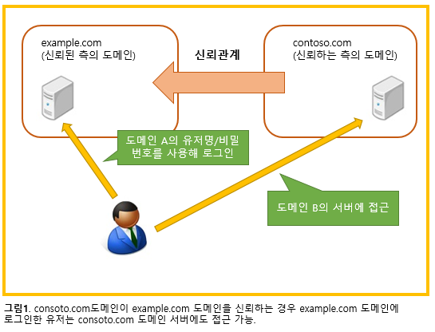
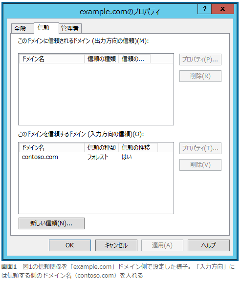
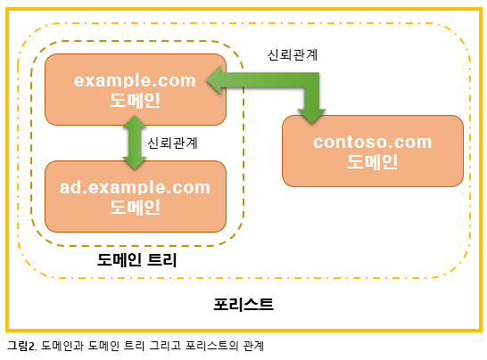

# Active Directory 도메인이란? 

## Active Directory와 도메인, 무엇이 다를까?

저번 장에서 「도메인」은 유저명과 비밀번호를 사용해 「당신은 누구?」 를 확인하고 유저명과 비밀번호가 확인된 유저가 접근할 수 있는 범위라고 설명했다.  그러면 Active Directory와 도메인은 어떻게 다를까?

일반적으로 Active Directory와 도메인은 같은 의미로 사용되고 있다. 엄밀히 말하면 도메인은 「한번의 로그인으로 접속할 수 있는 범위」를 가리키고, Active Directory는 「마이크로소프트가 제공하는 유저 관리에 관한 여러가지 역할」을 가리킨다. 

원래 Active Directory는  「도메인의 기능」을 가리키고 있어서  「Active Directory = 도메인」 이라는 인식이 있다. 그렇지만 Windows Server2008부터는 Active Directory가 제공하는 기능이 확장되었고 아래의 5가지 역할이 있다. 

Active Directory가 제공하는 역할 명 |설명
---- | ----
Active Directory 도메인 서비스|도메인의 기능을 제공
Active Directory 인증서 서비스|사내 인증국으로서의 기능을 제공
Active Directory Federation 서비스|조직간의 SSO기능을 제공
Active Directory Rights Management 서비스|특정 파일에 대해 암호화와 접근제어기능을 제공함
Active Directory Lightweight Directory Service|디렉토리 데이터베이스 기능을 제공

즉, Active Directory는 「도메인의 기능을 포함해 여러가지 기능의 집합체」 이기 때문에 기능 이름이라기 보다는 브랜드 이름이란 표현이 정확하다. 

그런데 옛날부터의 영향인지 현재까지도 Active Directory = 도메인 이라고 표현되고 있다. 여러가지 설명을 했는데, 이 연재에서는 Active Directory의 도메인서비스만 거론하기 때문에 Active Directory와 도메인은 같다라고 생각해도 무방하다.

## 도메인은 몇 개가 필요할까?

전 장에서 도메인을 구성함으로써, 워크그룹처럼 서버마다 다른 유저명과 패스워드를 입력할 필요가 없어지고 한번의 로그인으로 사내의 다양한 서버에 접속할 수 있음을 소개했다. 

한편 도메인은 도메인 간을 연결시키는 「신뢰관계」 라는 기능이 있고 이에 따라 도메인을 여러 개 작성해 운용할 수 있다.  

그러면 당신이 회사의 도메인을 작성하는 입장에 있다고 하면 몇 개의 도메인을 작성할 것인가? 

이 의문을 해결하기위해 우선 Active Directory의 「신뢰관계」라는 개념부터 짚고 넘어가자. Active Directory의 신뢰관계는 「로그인한 유저가 접근 가능한 범위를 확장하는 기능」이다.  도메인을 2개이상 작성한 경우 이 신뢰관계에 의해 한 개의 도메인에서 로그인을 하면 다른 도메인도 접근이 가능하다. 

이 신뢰관계에는 「방향」이라는 것이 있다. 그림1에서 「contoso.com」도메인이 「example.com」도메인을 신뢰한다라는 신뢰관계가 설정되어있다. 이 신뢰관계를 알기 쉽게 그림1에서는 빨간 화살표로 표시되어있다. 빨간화살표는 「contoso.com」도메인이 「example.com」도메인을 신뢰하고 있다는 것을 의미한다.  이것이 신뢰관계의 방향을 나타낸다. 

실제의 설정화면에서는 빨간 화살표로 방향을 표시하지않지만, 신뢰관계를 설정할 때는 「oo이 xx를 신뢰한다」라고 빨간 화살표를 종이에 적어두면 알기쉽다. 

그림1처럼 신뢰관계를 설정하고 있는 경우, 신뢰된 도메인(example.com)은 신뢰하는 측의 도메인 (contoso.com)에 유저명과 비밀번호를 입력하지 않고 접근이 가능하다. 

Active Directory에서 신뢰관계의 방향을 설정하는 경우 「Active Directory도메인과 신뢰관계」 관리 툴을 사용한다. 화면의 설명을 보면 보기 어렵기 때문에, 입력방향에는 신뢰하는 측의 도메인을 입력한다 라고 기억해두자. 

지금까지 한번의 인증으로 접근 가능한 범위가 도메인이라는 것을, 그리고 신뢰관계를 사용해 접근 가능한 범위가 확장된다는 것을 이해 했을 것이다. 이런 설명을 하면 신뢰관계는 어쩐지 편할 것 같고 적극적으로 사용하고 싶은 심정 일지도 모른다. 

그러나, 전 장에서 설명한 것을 기억 하길 바란다.  Active Directory(도메인 서비스)는 당신은 누구?를 확인하는 구조라는 것을.

하나의 도메인 안에서는 유저명은 일원적으로 관리되기 때문에, 같은 이름을 가진 유저를 2개 만들 수 없다. 그러나 신뢰관계를 설정한 도메인이 여러 개 존재하면 각각의 도메인에 같은 이름의 유저를 만들 수 있다.  여러 개의 도메인에서 같은 이름을 가진 유저를 만들면 관리가 매우 어려워진다. 그 때문에 기본적으로 도메인은 여러 개 만들지 않고, 한 개로 운용하는게 좋다. 

회사에서 도메인을 두개 이상 만드는 경우도 종종 보인다.  왜 운용이 어려워지기 쉬운 도메인을 여러 개 만드는 것일까? 이것에는 여러가지 이유가 있다. 

#####첫번째, 회사가 합병되었다.
필자의 아는 사람 중에 「이직 경험은 없지만 자신이 근무하고있는 회사의 이름이 3번이나 바뀌었다.」 라는 사람이 있다. 합병된 2개의 회사에 각각의 Active Directory가 도입되어 있는 경우 그것을 하나로 모으는 것은 굉장히 어렵기때문에 신뢰관계로 2개의 도메인을 그대로 운용했던 케이스가 있다.  2개의 도메인에 신뢰관계가 설정되면 어느 쪽 도메인에 로그인할지를 유저가 지정할 수 있다. 

#####두번째, 관리를 각각 하고 싶다.
모회사와 자회사 같은 회사인 경우 IT시스템은 통일되어 있지만 관리는 각각의 회사에서 하는 경우가 있다. 만약 2개 회사의 도메인이 1가지로 집약되어 있으면, 「Administrator」 유저로 로그인 하면 양쪽의 Active Directory를 관리할 수 있다. 그래서 2개의 도메인으로 나누려고 한다.

위의 글을 보면 어쩔 수 없이 도메인을 여러 개 만든다는 것을 알 수 있다. 사내에서 도메인을 여러개 만들면 관리는 각각 하게 되고 복잡해진다. 회사의 도메인은 1개로 하는 것을 목표로 해야한다.

## 포리스트와 도메인트리에 의한 신뢰관계

Active Directory의 신뢰관계를 이야기 할 때 빼놓을 수 없는 것이 「포리스트」「도메인트리」 라고 불리는 구성이다.  신뢰관계는 「Active Directory도메인과 신뢰관계」 관리 툴에서 설정한다. 그러나  「Active Directory도메인과 신뢰관계」 관리 툴을 사용하지않아도 자동적으로 설정되는 신뢰관계가 포리스트나 도메인트리가 된다. 

포리스트와 도메인트리는 모두 도메인 작성 시 설정 가능한 쌍방향의 신뢰관계이다. 포리스트는 Active Directory의 관리 경계를 표시하는 그룹같은 것으로, 도메인 작성 시에 이미 존재하는 도메인과 같은 포리스트에 속하는지를 선택하고 결정한다. 

도메인트리는 포리스트내의 도메인간의 관계성을 표시한 것으로 기존에 존재하는 도메인과 같은 도메인이름 공간을 공유한다. 쉽게 예를 들면 「example.com」 이라고 하는 이름의 도메인이 있는 경우 「ad.example.com」과 같이 이미 있는 도매인명을 계승해 새로운 도메인명을 설정하는 경우 「example.com」와 「ad.example.com」는 도메인트리라고 불리는 관계가 된다. 

포리스트와 도메인트리는 몇가지 장점이 있는데 그것은 다음 기회에 소개할 예정이다. 여기서는 포리스트와 도메인트리는 도메인 작성시 「포리스트의 일부로 할 것인가」 「도메인의 일부로 할 것 인가」를 결정하는 점에 주목하자. 

포리스트나 도메인트리는 도메인 작성시에만 설정가능하기 때문에 포리스트안의 여러 개의 도매인이 있거나 도메인트리가  만들어져 있는 경우는 도메인을 작성하는 시점에서 계획적으로 도메인을 2개이상  만들어 운용하려고 하는 것이다. 

만약 당신의 회사가 포리스트내에 2개이상의 도메인으로 운용하고있다면 왜 도메인을 2개이상 만들 필요가 있었는지 생각해보자.

관리를 따로 하는 것을 목표로 했을까?
관리를 따로 할 필요가 있었을까?

그 이유를 찾아보면 현재 운용이 적절한지 여부를 확인 할 수 있을 것이다. 

이번 장에서는 Active Directory도메인 서비스에서 제공하는 도메인의 기능에 대해 설명했다. 다음 장에서는 도메인컨트롤러에 대해 알아보자.

