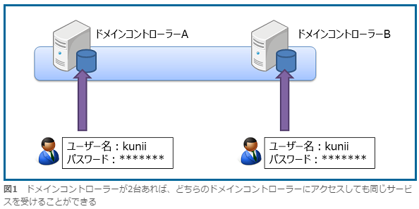
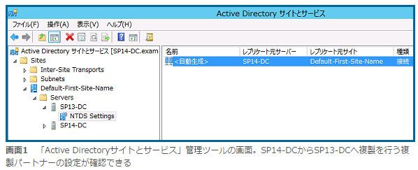
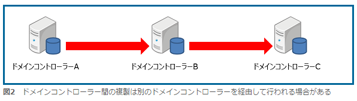
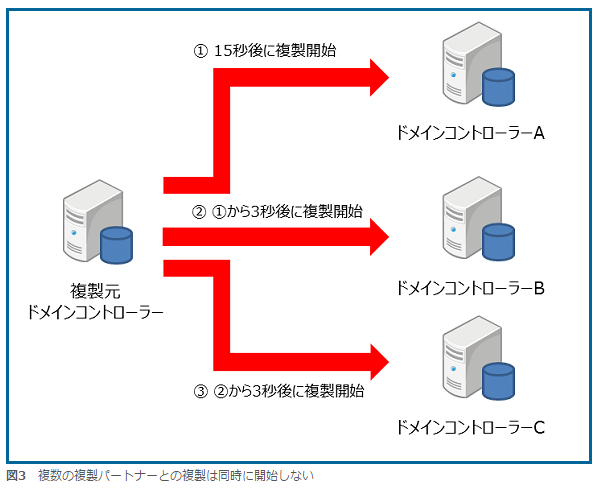
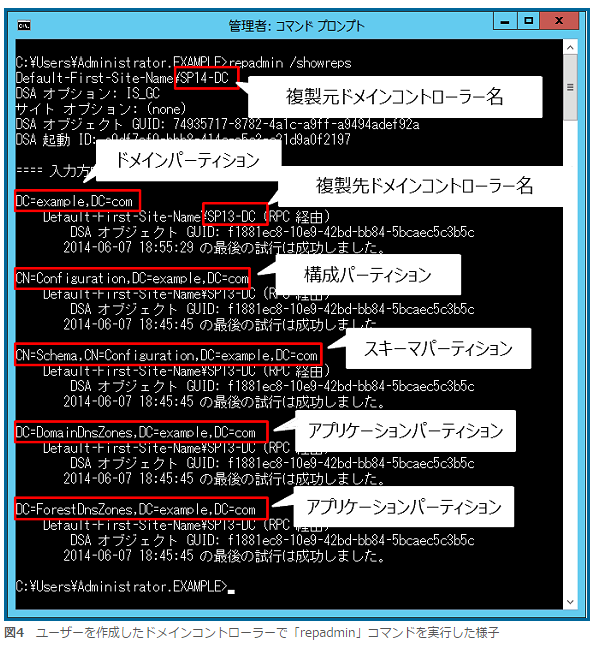

# 도메인 컨트롤러의 복제

## 복제의 구조를 알아보자!

2대의 도메인컨트롤러로 어떻게 데이터베이스의 내용을 똑같이 만들 수 있을까라는 의문을 가졌을지 모른다. 이번은 그 의문에 대답해나가는 걸로 하자.

도메인 컨트롤러는 유저 인증 등 중요한 역할을 맡고있는 서버이기때문에, 만약 도메인컨트롤러에 문제가 발생해 이용할 수 없게 되면 시스템전체에 큰 영향을 미친다. 그래서 도메인컨트롤러는 2대이상의 서버를 준비해 무슨 일이 있을 경우를 대비해 어느 쪽 서버도 같은 역할을 수행하도록 한다. 그때 2대의 도메인컨트롤러는 같은 내용의 데이터베이스를 가지고 있어야한다. 

 
여기서 AD에서 도메인컨트롤러끼리 정기적으로 데이터베이스의 내용을 확인하고 자동으로 그 내용을 동일하게하기위해 동기 처리를 행한다. 이것이 도메인컨트롤러의 복제라고 불리는 처리이다. 

복제에서는 도메인컨트롤러 A에서 유저를 만들고 그 정보가 도메인컨트롤러 B의 데이터베이스에도 반영되도록 동기 처리가 행해진다. 또, 도메인컨트롤러 B에서 유저명을 변경하면 그 정보는 A의 데이터베이스에도 반영된다.

즉, AD에서는 어느 도메인 컨트롤러에서든 오브젝트의 작성, 변경, 제거가 일어나면 그 정보를 다른 컨트롤러의 데이터베이스에 복제하도록 한다.

## 복제를 행하는 도메인컨트롤러는 누구?

AD에서 2대째 이후의 도메인컨트롤러를 인스톨하면, 자동적으로 자신이 복제할 상대(도메인컨트롤러)를 찾아, 필요에 따라 복제를 하게 된다.  즉, 2대째 이후의 도메인컨트롤러에서는 복제를 설정을 하지않아도 자동적으로 복제 상대를 설정하고, 복제가 시작되는 것이다. 이 때, 직접 복제를 행하는 상대를 「복제파트너」라고 부른다. 각각의 도메인컨트롤러에 복제파트너는  「Active Directory사이트와 서비스」관리 툴에서 확인할 수 있다.

그러나 3대이상의 도메인컨트롤러가 존재 할 경우에는 자동적으로 설정된 복제 파트너의 설정에서는 복제가 직접적으로 행해진다고 한정 지을 수 없다. 예를 들면, 아래 그림처럼 도메인컨트롤러 A에 유저를 등록한 경우, 그 내용이 도메인컨트롤러 B에 복제된 후에 도메인컨트롤러 B를 경유해 도메인컨트롤러 C에 복제되도록 복제파트너를 설정한 경우도 있다.

그렇게 되면, 도메인컨트롤러 C는 변경내용을 받을 때 까지(짧은 시간이지만)  시간이 필요하다. 만약 A에서 데이터의 변경이 일어나면 바로 그 정보를 받을 수 있도록 하고 싶다면 A와 C사이에서 직접복제하도록 「Active Directory사이트와 서비스」관리툴에서 복제파트너를 수동으로 설정하면된다.

## 복제는 언제 이루어지는가?

도메인컨트롤러의 복제는 필요에 따라 행해진다고 소개했는데, 정확히 말하면 아래와 같은 타이밍에 행해진다.

	• 오브젝트의 작성, 변경, 제거가 일어난 경우에 「15초후」에 복제가 시작된다.
	• 복제할 도메인컨트롤러로부터 복제대상의 도메인컨트롤러에 대해 변경을 통지하는 것으로 복제를 시작한다. (즉 15초후 변경을 통지한다)
	• 복제파트너가 여러 개 존재할 경우, 각각의 복제파트너에 대해  「3초늦게」 변경을 통지한다. 

단, 사이트 간의 복제를 하는 경우는 지금까지 소개한 복제 간격과 달라진다. 사이트라는 개념에 대해서는 다음에 소개할 예정이다. 

또, 테스트나 트러블슈팅의 목적으로 복제를 바로 실행하고 싶을 경우에는, 
 「Active Directory사이트와 서비스」 관리 툴을 시작으로, 강제적으로 실행할 수 있는 방법이 몇가지 있다.  아래의 글을 참고 해라.

<http://www.atmarkit.co.jp/fwin2k/win2ktips/285adrepl/adrepl.html>

## 비밀번호의 복제는 언제 이루어질까?

사이트 간의 복제이외에도 복제가 시작되는 타이밍에는 한가지 예외가 있다. 그것이 비밀번호 복제이다. 비밀번호와 같이 내용 변경이 주는 영향이 큰 것은 15초를 기다리지않고 바로 복제가 시작된다.

여기까지 복제는 복제파트너에 대해 실행된다고 설명했지만, 비밀번호의 복제에 관해서는 반드시 최초의 「PDC에뮬레이터」라는 역할을 가진 도메인컨트롤러에 대해서  「지금 바로」 복제가 실행된다. 그리고 그 이후의 복제는 지금까지 설명한 타이밍(즉, 15초 이후)에 실행된다.

만약, 패스워드의 변경 직후 새로운 비밀번호로 유저가 로그인하면, 도메인컨트롤에 의해 비밀번호가 아직 변경되지않은 경우도 있다. 그 경우에는 도메인컨트롤러는 PDC에뮬레이터를 참조하기 때문에, 새로운 비밀번호가 모든 도메인컨트롤러에 복제되어 있지않아도 로그인에 실패할 일은 없다.

> 긴급 리플리케이션이란?

> 비밀번호의 복제이외에도 AD에서는 변경내용을 다른 도메인컨트롤러에 바로 복제해야하는 정보가 있다. 이러한 정보는 「긴급 리플리케이션」이라고 불리우는 복제방법으로 15초를 기다리지 않고 바로 복제가 실행된다.

> 긴급리플리케이션에 해당하는 주된 변경내용에는 아래와 같은 내용이 있다. 

> - Account lockout의 각종 설정(lockout이란 비밀번호를 일정 횟수 틀렸을 경우 로그인 자체를 사용하지 못하게 하는 설정)
- 비밀번호정책의 변경(비밀번호의 문자수를 몇 글자 이상으로 강제하는 등의 설정)

> 긴급리플리케이션은 비밀번호의 복제와는 다르게 복제파트너로서 지정된 상대에 대해 「지금 바로」 복제가 행해진다.

## 복제파트너와 다른 버전의 Windows Server는 괜찮을까?

답부터 먼저 말하자면, 다른 버전의 윈도우서버를 복제파트너로 하는 것은 가능하다.

OS의 버전이 다른 도메인컨트롤러끼리 복제를 하는 경우, 새로운 OS버전의 도메인컨트롤러에서만 사용이 가능한 기능에 대한 설정을 옛날 버전의 도메인컨트롤러에 적용 할 수 없는 문제가 생긴다. 

여기서 AD에서 새로운 버전의 도메인컨트롤러측에 일부러 새로운 AD기능을 사용할 수 없도록 해서 옛날 버전의 도메인컨트롤러간 복제 할 수 있도록 한다.

일부러 새로운 AD기능을 사용할 수 없도록 하는 것은, AD의 「도메인기능수준」 과  「포리스트기능수준」이다. 각각의 기능수준에서 OS버전을 선택할 수 있도록 되어있고, 선택한 OS버전이상의 기능을 사용할 수 없도록 제한이 걸린다.

예를 들면 도메인컨트롤라가 Windows Server 2008과 Windows Server 2012 R2 2대로 구성된 AD도메인의 경우, 선택 가능한 도메인 기능 수준과 포리스트 기능 수준이 각각 Windows Server 2008이 된다.  이것에 의해 Windows Server 2012 R2의 도메인컨트롤러에서 이용할 수 있는 AD의 기능은 Windows Server2008에서 이용할 수 있는 기능까지로 제한되고 결과적으로 Windows Server 2008의 도메인컨트롤러는 Windows Server 2012 R2의 도메인컨트롤러간의 복제가 이루어진다. 도메인/포리스트의 기능 수준에 대해서는 아래의 글을 참고해라.

<http://www.atmarkit.co.jp/ait/articles/0905/22/news121.html>

## 복제가 잘 진행되는 것을 확인하려면?

지금까지 도메인컨트롤러간의 복제에 대해 설명했는데, 실은 도메인컨트롤러간의 복제는 여러 개로 나뉘어 실행된다. 

AD의 데이터베이스는 「파티션」 이라고 불리는 단위로 분할 되어있고, 복제는 파티션단위로 진행된다. 일반적으로 도메인컨트롤러에서는 아래의 4가지 파티션을 가진다.

1. 도메인 파티션 
	도메인 내에 작성된 오브젝트를 저장하기위한 영역. 도메인파티션에 저장된 데이터는 「Active Directory사용자와 컴퓨터」 관리 툴에서 확인가능하다.
2. 구성 파티션
	포리스트내의 구성 정보를 저장하기 위한 영역. 구성파티션에 저장된 데이터는  「Active Directory사이트와 서비스」 관리 툴이나  「Active Directory도메인과 신뢰관계」 관리 툴에서 확인 할 수 있다.
3. 스키마 파티션
	Active Directory 데이터베이스에 저장 가능한 오브젝트의 종류와 프로퍼티의 종류 등에 대한 데이터를 저장하기위한 영역. 스키마 파티션에 저장된 데이터는 「Active Directory스키마」 관리 툴에서 확일 할 수 있다.
4. 어플리케이션 파티션
	어플리케이션을 취급하는 데이터를 Active Directory데이터베이스에 저장할 수 있도록 준비된 영역. 일반적으로 도메인컨트롤러에 인스톨된 DNS서버의 데이터베이스가 저장되어 있다.

위 네 가지 파티션이 각각의 파티션단위로 복제 파트너와의 사이에 복제된다. 각 파티션의 복제 상황은 여러가지 방법으로 확인 할 수 있는데, 그 중에서「repadmin 」 커맨드를 이용해 확인하는 방법을 설명하겠다. 도메인컨트롤러의 커맨드포롬포트에서 「repadmin / showreps」 커맨드를 실행한다. 그러면 아래와 같은 결과를 확인할 수 있다.  

그림4는 유저를 작성한 뒤, 유저를 작성한 도메인컨트롤러 SP14-DC상에서 「repadmin 」커맨드를 실행한 상태이다. 「SP14-DC 」 도메인컨트롤러로부터 「SP13-DC 」 도메인컨트롤러에의 복제 상황을 표시하고 있고, 도메인파티션을 나타내는 「DC = example, DC=com 」에서는 「2014년 6월 7일 18시 55분 29초」에 복제가 이루어진것을 확인 할 수 있다. 

한편, 「DC = configuration 」 에서 시작되는 항목의 구성 파티션, 「DC = Shema 」에서 시작되는 항목 스키마파티션 「DC = DomainDNSZones」와 「DC = ForestDNSZones 」에서 시작되는 항목의 어플리케이션파티션은 각각 「2014년 6월 7일 18시45분 45초」에 복제가 이루어진것을 확인 할 수 있다.

도메인컨트롤러는 AD에서 중요한 역할을 하고 있기 때문에, 여러 대의 서버에서 운용하는 것이 중요하다는 것을 소개하고, 각각의 도메인컨트롤러는 복제를 행해서 같은 AD데이터베이스 내용을 보유하고있는 것을 확인했다. AD에서는 특별한 설정을 하지않고도, 도메인컨트롤러를 인스톨하면 복제가 시작된다. 하지만 도메인컨트롤러의 복제 구조를 정확히 이해해 두면 보다 쉽게 Active Directory를 운용 할 수 있을 것이다.

