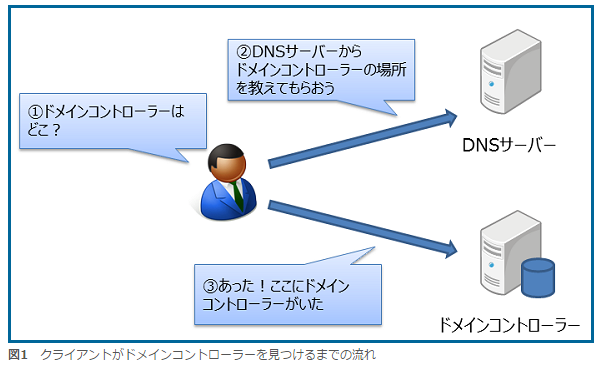
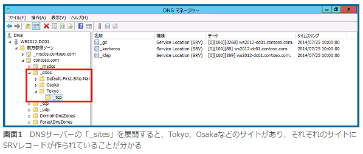
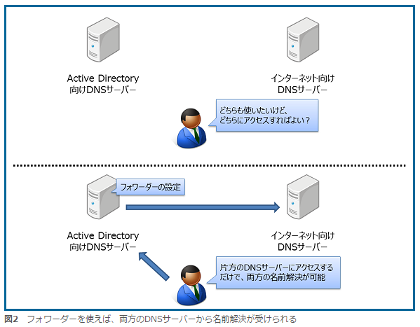
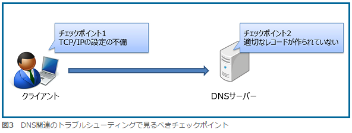
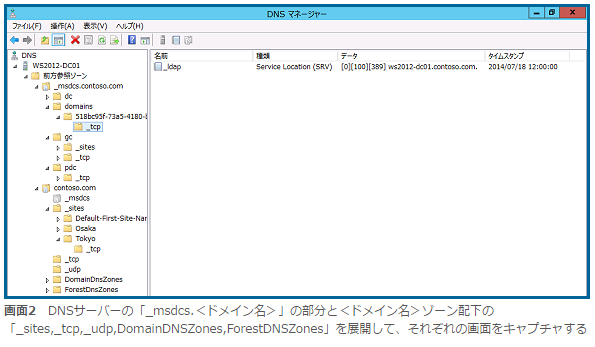

# DNS서버는 왜 필요한가

## Active Directory의 트러블의 원흉은 DNS?

"Active Directory의 트러블의 대다수는 DNS꼬임" 이것은 Active Directory관리자 사이에서 옛날부터 알려져 온 것이다.

왜, Active Directory에는 이름해결서비스를 제공하는 「DNS」 (Domain Name System) 서버가 필요한 것일까?  그 이유는 DNS서버가  보유한 「SRV레코드」의 존재에 있다.

SRV레코드는 조직 내에서 이용하는 여러가지 서비스가 어느 장소에서 제공되는 것일까 (제공되고있는 서비스의 위치정보) 를 표시하기 위한 레코드이다. Active Directory에서는 도메인컨트롤러의 장소를 특정하기 위해서 SRV레코드가 이용된다.  
(*참고 사이트<http://www.atmarkit.co.jp/fnetwork/dnstips/042.html>)

## 도메인컨트롤러의 거처는 SRV레코드에 정의

Active Directory에서 DNS서버를 이용하는 최대의 이유는 클라이언트가 도메인컨트롤러에 접근할 때 어디에 도메인컨트롤러가 있을까를 확인하기 위해서 이다.

Active Directory에서는 클라이언트가 도메인에 참가하거나 로그인하거나, 도메인내의 각 서버를 이용하거나 할 때에 도메인컨트롤러에 접근한다. 이들의 통신이 제대로 이뤄지도록 하기 위해 클라이언트는 도메인컨트롤러에 접근하기 전에 처음으로 DNS서버에 접속하게 된다. 그리고 DNS서버에 접속하면 SRV레코드를 이용해서 도메인컨트롤러가 있는 곳을 알려준다. 

이것은 도메인컨트롤러가 데이터베이스를 리플리케이션(복제)하기 위해 다른 도메인컨트롤러에 접근 할 경우도 똑같다. 

## 사이트내의 도메인컨트롤러를 특정한다.

Active Directory의 클라이언트는 반드시 가까이 있는 도메인컨트롤러에 접근하려고 한다. 그리고 가까이 있는 도메인컨트롤러를 찾는 방법으로 「사이트」를 이용한다. 클라이언트가 자신과 같은 사이트내에 있는 도메인컨트롤러를 찾을 때는 역시 DNS서버의 SRV레코드를 이용한다. 실제로 DNS서버 안을 보면 SRV레코드가 사이트 별로 나뉘어 저장되고 있는 것을 알 수 있다. 

## 인터넷용 DNS서버와의 관계

애초에 DNS서버는 인터넷상에 있는 여러가지 서버의 이름 해결을 위해 용의 된 것이고, 보통 자기 회사에 인터넷용의 DNS서버를 구축하거나, 서비스 프로바이더가 제공하는 DNS서버를 이용하거나 할 것이다.

한편 Active Directory의 DNS서버는 도메인컨트롤러의 있는 곳을 특정하기 위해 특화된 서버이다. 

DNS서버에 저장된 인터넷용 정보와 사내용의 정보와 보안 수준이 각각 다르기 때문에 동일한 서버에 저장해서는 안된다. 그렇기 때문에 Active Directory환경에서는 인터넷용과 사내용 (Active Directory) 에 다른 DNS서버를 준비해 운용하게 되는데 이렇게 되면 두개의 DNS서버를 신경써야하기 때문에 운용이 번거로워 진다. 그래서 일반적으로는 DNS서버가 탑재된 「포워더」 기능을 사용해 운용의 번거로움을 해결한다. 

포워더(forwarder)는 클라이언트로부터 문의(이름해결요구)를 받은 DNS서버가 답을 모른 경우 다른 DNS서버에 이름해결요구 전부를 맡기는 기능이다.  DNS서버는 포워더를 사용해 자신이 모르는 것은 다른 사람에게 물어보는 방법으로 여러가지 이름해결요구를 대응한다. 

이렇게 해서 인터넷용의 DNS서버와 Active Directory의 DNS서버 양쪽에 접근해야 하는 경우에도 포워더 기능을 사용해 클라이언트는 어느 DNS서버에 접근해도 두개의 DNS서버로부터 이름해결을 받게 된다.

## 인터넷용과 Active Directory가 같은 이름인 경우 대처

Active Directory도메인은, 다양한 이름을 붙이는 방법이 있다. 첫 번째는 조직의 도메인명과 같은 이름으로, Active Directory의 도메인명으로 하는 방법이다. 이름을 하나로 집약해 보기에는 관리가 쉬울 것 같다. 하지만 DNS의 관점에서 말하면 한가지 주의해야 할 것이 있다. 그것은 포워더를 사용해도 두개의 DNS서버에는 동시에 접속할 수 없다는 것이다. 

예를 들면 도메인명  「example.com」을 가진 조직이 Active Directory의 도메인명을 똑같이 「example.com」으로 설정했다고 하자. 조직의 웹사이트나 메일서버에 접급하기위한 정보를 저장해둔 DNS서버(사외용 DNS서버) 와 Active Directory의 dNS서버를 각각 준비해서 Active Directory의 DNS서버로부터 사외용 DNS서버에 포워더를 설정한다. 

그러나 이 포워더 설정에서는 조직내의 클라이언트컴퓨터로부터 사외용 DNS서버의 이름해결을 하지않는다. 왜냐하면 클라이언트는 「example.com」도메인의 이름해결을 이미 Active Directory의 DNS서버에서 실행되었고, Active DirectoryDNS서버에 저장되어 있지않은 정보를 찾으로 다른 「example.com」존의 정보를 가진 DNS서버에 접근해도 그곳에서 이름해결을 할 필요는 없기 때문이다. 

그렇기 때문에 조직의 도메인명과 Active Directory의 도메인명이 같은 경우는 사외용 DNS서버에 저장되어있는 정보와 같은 정보를 Active Directory의 DNS서버에도 저장시켜 두는 것이 가장 좋은 방법이다. 

## 여기까지 얻은 지식으로 DNS서버의 트러블 해결에 도전!

Active Directory의 DNS서버는 클라이언트로부터 Active Directory에 접근 할 때 그 장소를 확인하기 위해 사용된다고 설명했는데 실제로 어떤 통신이 발생하는지를 알아보자. 

**체크포인트 1 **
먼저 클라이언트는 도메인컨트롤러의 장소를 확인 하기 위해 DNS서버에 접근한다. 클라이언트로부터 DNS서버에 접근하려면 클라이언트의 TCP/IP설정으로 DNS서버의 IP주소가 지정되어 있어야 한다. 

또, IPv6가 활성화 되어있거나 (두개의 NIC를 탑재하고 있기 때문에) 두개의 네트워크에 접근 할 수 있도록 구성되어 있는 것으로 참조하는 DNS서버가 매번 달라지거나 여러 이유로 마음대로 DNS서버에 접근할 수 없는 경우에도 주의한다. 

**체크포인트2**
클라이언트의 문제를 해결하고, 무사히 DNS서버에 접근 할 수 있어도 DNS서버에 올바른 레코드가 등록되어 있지않으면 도메인 컨트롤러의 장소를 특정 할 수 없다. 그래서 클라이언트의 다음 체크해야 할 것은 DNS서버의 레코드의 설정이다. 

등록되어있는 DNS서버의 SRV레코드가 올바른지 눈으로 확인하는 것도 하나의 방법이다. 그렇지만 보다 간단하게 해결 하려면 SRV레코드를 다시 만드는 것도 좋은 방법이다. SRV레코드를 다시 만드는 것은 간단하다. 도메인컨트롤러상에서 Windows PowerShell의 「Restart-Service netlogon」 커맨드를 실행하면 된다.

또, 자동적으로 작성된 SRV레코드가 올바른지 확인하고 싶은 경우에는, 미리 올바른 상태의 SRV레코드의 구성을 보존해 두고 그것과 비교하면 좋다. 사전에 아래 그림과 같이 정상적인 DNS서버의 스크린 샷을 찍는 것을 추천한다.

여기까지 Active Directory에 대한 DNS서버의 필요성에 대해 설명했다. Active Directory의 트러블의 대부분이 DNS와 관련이 있다고 설명했는데 지금까지 본 것과 같은 구조에서 Active Directory의 DNS서버가 사용되고 있는 것을 알았다면 트러블이 생겨도 내가 문제의 원인을 추측하고 문제를 해결할 수 있을 것이다. 

